<h1 align="center">Adhyayan</h1>
<p align="center"><em>अध्ययन — dedicated study.<br/><strong>Read deeply. Finish completely.</strong></em></p>

<p align="center">
  
  
  
  
  
</p>

A text-first learning platform built to prove one thing: that a complete student
journey — **discover → enrol → learn → certify** — can be instrumented thoroughly
enough that a model picks the learner's next lesson better than the learner does.

The differentiator is that reading time measures **attention, not tab-open time**.
Leave a tab open on a chapter and it accrues nothing.

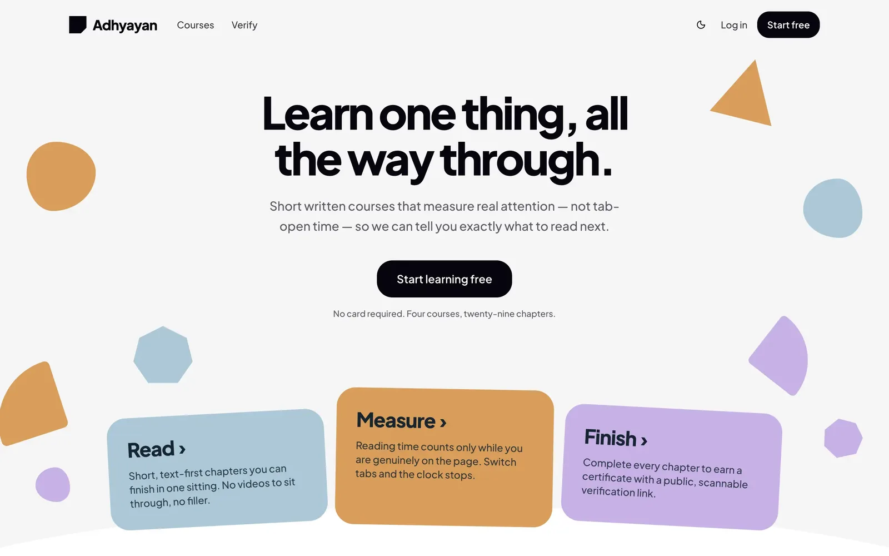

---

## Contents

- [Install](#install) · [Docker](#run-with-docker) · [Demo credentials](#demo-credentials)
- [Screens](#screens)
- [How attention is measured](#how-attention-is-measured)
- [The ML engine](#the-ml-engine)
- [Seed data](#seed-data) · [Commands](#commands) · [Layout](#project-layout)

---

## Install

### Prerequisites

| | Version | Needed for |
| --- | --- | --- |
| [Node.js](https://nodejs.org) | 24+ | the web app |
| [PostgreSQL](https://www.postgresql.org) | 17 | the database |
| [uv](https://docs.astral.sh/uv/) + Python | 3.13 | the ML engine (optional) |
| [Docker](https://docs.docker.com/get-docker/) | 29+ | the containerised stack (optional) |

Check what you have:

```bash
node --version      # v24.x
psql --version      # 17.x
```

### 1. Clone and install

```bash
git clone https://github.com/Rex-Arnab/adhyayan.git
cd adhyayan
npm install
```

### 2. Create the database

```bash
createdb adhyayan
```

### 3. Configure the environment

```bash
cp .env.example .env
```

Then edit `.env`:

```ini
DATABASE_URL="postgresql://YOUR_USER@localhost:5432/adhyayan"
AUTH_SECRET="paste the value from the command below"
AUTH_URL="http://localhost:3000"
```

Generate the secret:

```bash
npx auth secret
```

### 4. Migrate and seed

```bash
npx prisma migrate dev     # create the schema
npm run db:seed            # restore the bundled snapshot
```

Seeding restores a full, realistic database — 6 courses, 45 chapters, 62 learners,
7,174 events, **including the ML-generated recommendations**. Prisma 7 does not
seed automatically, so this step is explicit.

### 5. Start

```bash
npm run dev
```

Open **http://localhost:3000** and sign in with the credentials below.

> **One gotcha:** never run `npm run build` while `npm run dev` is running. Both
> write to `.next/` and the build clobbers dev's CSS chunks, leaving every page
> unstyled. Stop the dev server first; `rm -rf .next` recovers.

---

## Run with Docker

The whole stack — database, migrations, seed, and app — in one command:

```bash
git clone https://github.com/Rex-Arnab/adhyayan.git
cd adhyayan
```

Create a `.env` with a signing secret. Pick the line for your shell:

```bash
# macOS / Linux / Git Bash / WSL
echo "AUTH_SECRET=$(openssl rand -base64 32)" > .env
```

```powershell
# Windows PowerShell
"AUTH_SECRET=$([Convert]::ToBase64String((1..32|%{Get-Random -Max 256})))" | Out-File -Encoding ascii .env
```

```cmd
:: Windows cmd.exe — needs Node installed
node -e "console.log('AUTH_SECRET='+require('crypto').randomBytes(32).toString('base64'))" > .env
```

Then:

```bash
docker compose up --build
```

Open **http://localhost:3000**. Nothing else is required — no Node, no Postgres,
no Python on the host.

> If the build stops with `AUTH_SECRET ... is required`, the `.env` above was not
> created in the repo root. Compose refuses to start without it rather than
> falling back to a weak default.

On first start it migrates and restores the snapshot automatically. On every later
start it detects the existing data and **skips seeding**, so a restart never
destroys accounts you created. Use `FORCE_SEED=1` to re-seed deliberately.

Postgres is published on host port **5433** so it cannot collide with a local
Postgres on 5432. Every image tag is pinned.

To retrain the models against the containerised database:

```bash
docker compose run --rm ml
```

---

## Demo credentials

| Role | Email | Password |
| --- | --- | --- |
| Student | `student@demo.com` | `demo1234` |
| Admin | `admin@demo.com` | `demo1234` |

The admin account unlocks `/admin/insights`. A student hitting that route gets a
404, not a 403 — the page should not announce that it exists.

> These are published demo credentials. Change them before deploying anywhere reachable.

New passwords must be **8+ characters with a capital letter and a symbol** — the
register form shows a live strength meter and per-rule checklist, and the API
enforces the same policy from the same definition (`src/lib/password.ts`), so the
form cannot accept what the server rejects. The seeded `demo1234` predates the
policy and still signs in; it just could not be registered today.

---

## Screens

### Catalogue

Search and tag filters, with progress shown on courses you have started.

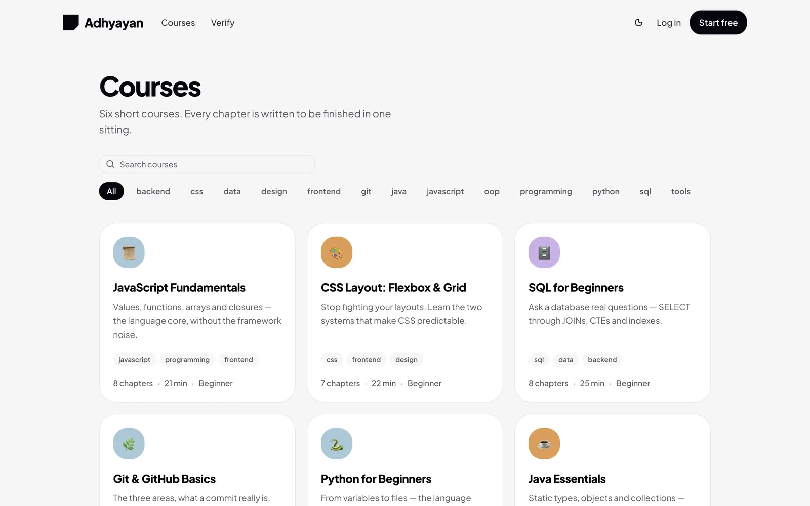

### Course detail

Chapter list with completion state. Chapter 1 is readable without an account.

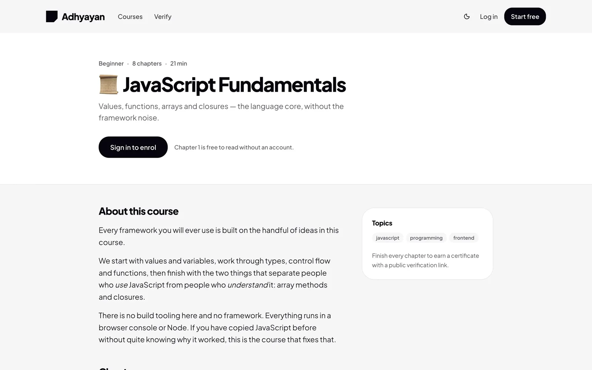

### The reader

The core screen. Text at a 68-character measure and 18px/1.75 line height, a
sticky chapter sidebar with a progress ring, and a footer showing **live reading
time that visibly pauses** when you switch away.

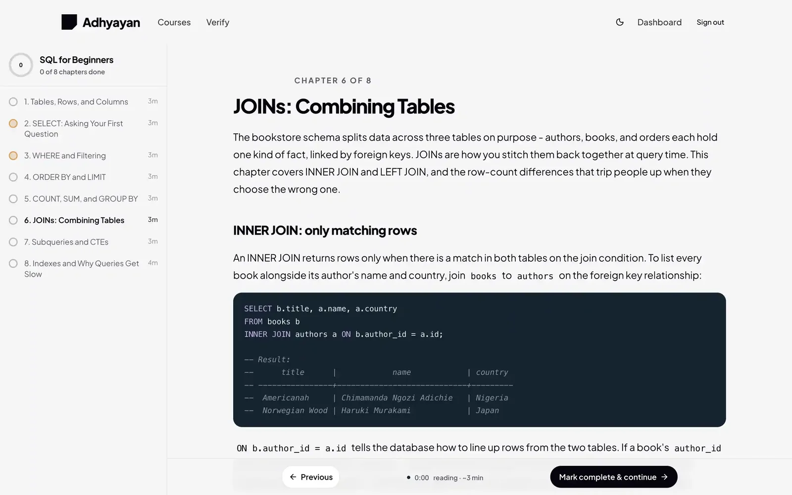

Dark mode, with syntax highlighting themed from the design tokens rather than a
stock highlight.js palette:

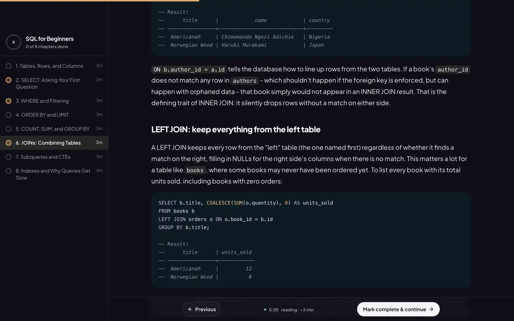

### Dashboard

Every number is a real query — measured reading time, derived words-per-minute,
streak, and recommendations with reasons grounded in actual behaviour.

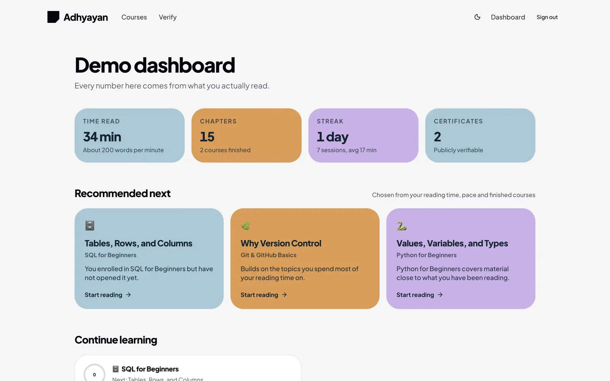

### Certificate

Issued in the same transaction as course completion, so a course can never be
complete without one. Generated on demand as a real PDF — A4 landscape, with a QR
code that resolves to the public verification page.

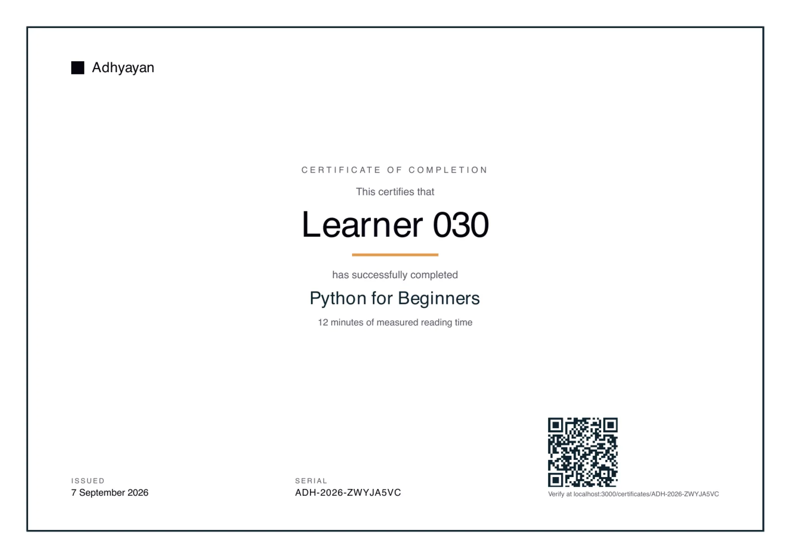

### Verification

Public by design: anyone holding the serial can check it, signed in or not.

| Look up a serial | Verified certificate |
| --- | --- |
| 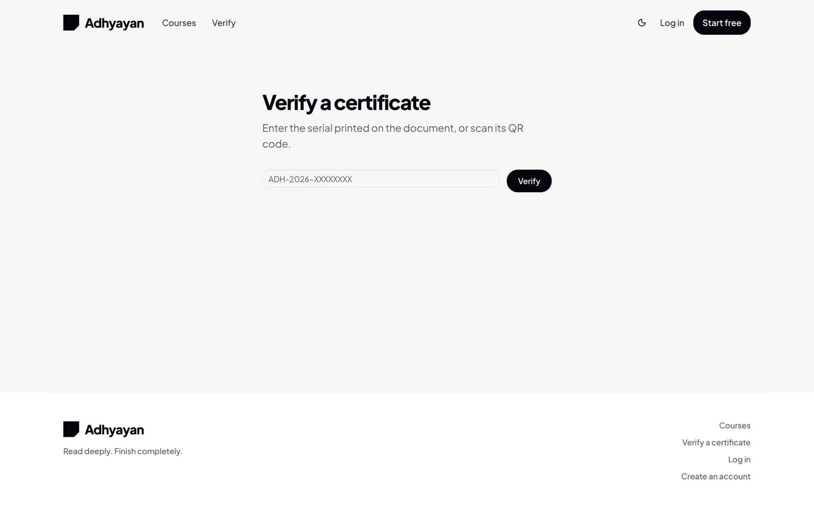 | 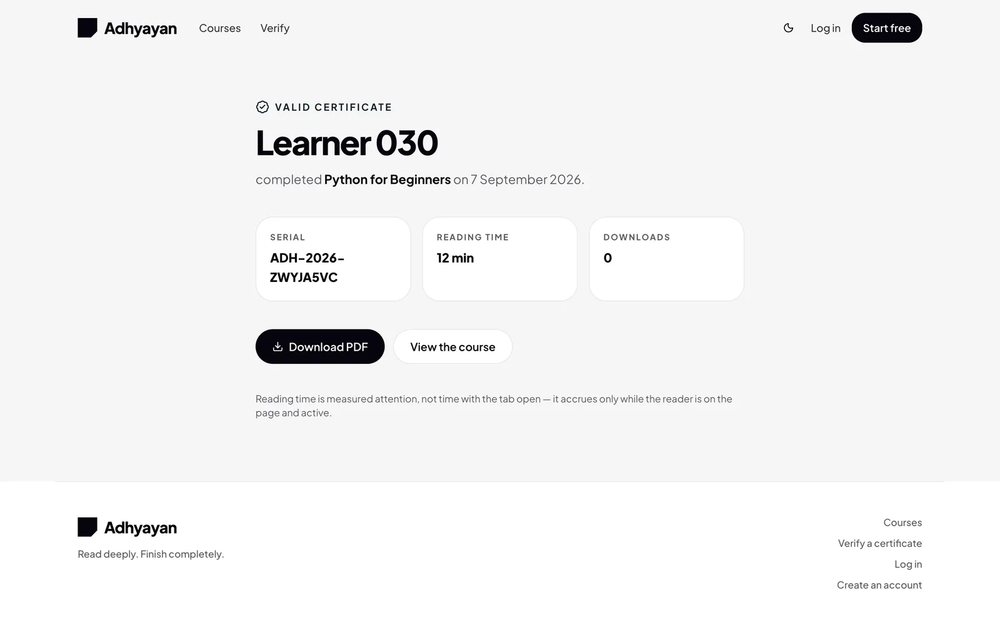 |

### Admin insights

Funnel, click-through by source and by A/B variant, events per day, reading time
per chapter — and the model's own scorecard.

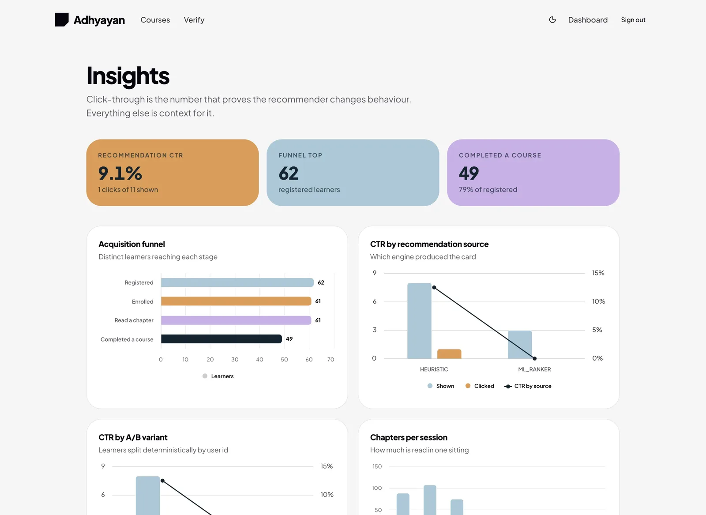

The four-arm comparison, learned feature weights, and KMeans learner personas:

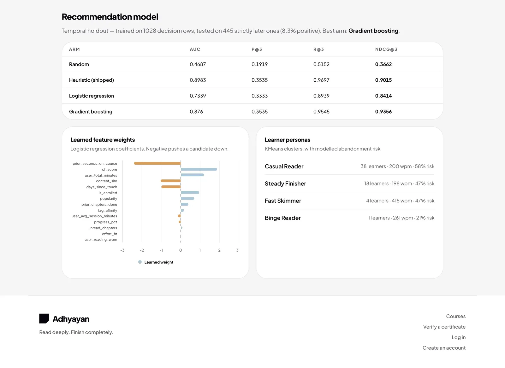

### Auth

| Sign in | Create an account |
| --- | --- |
| 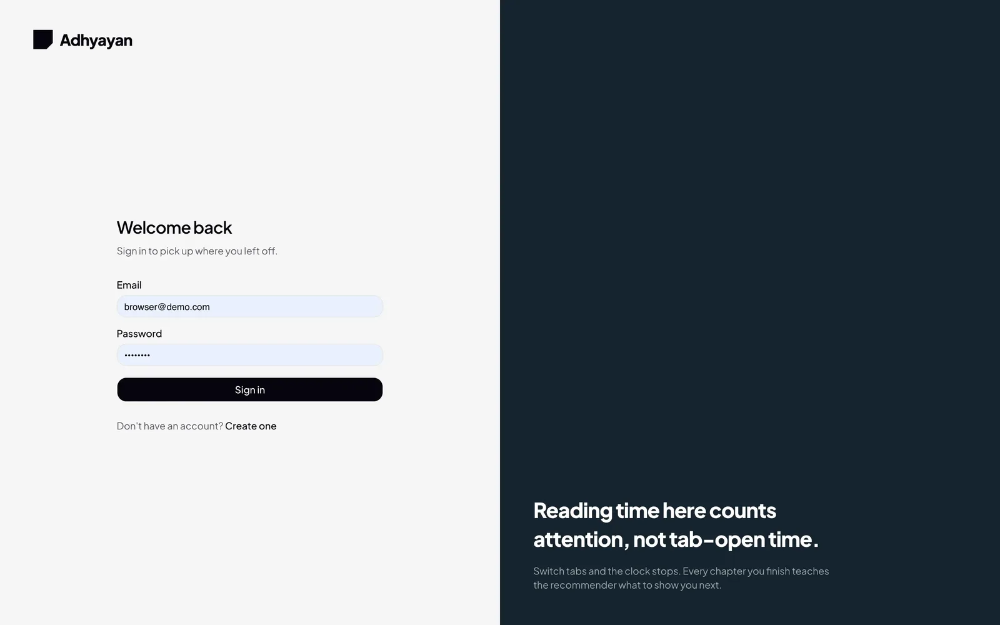 | 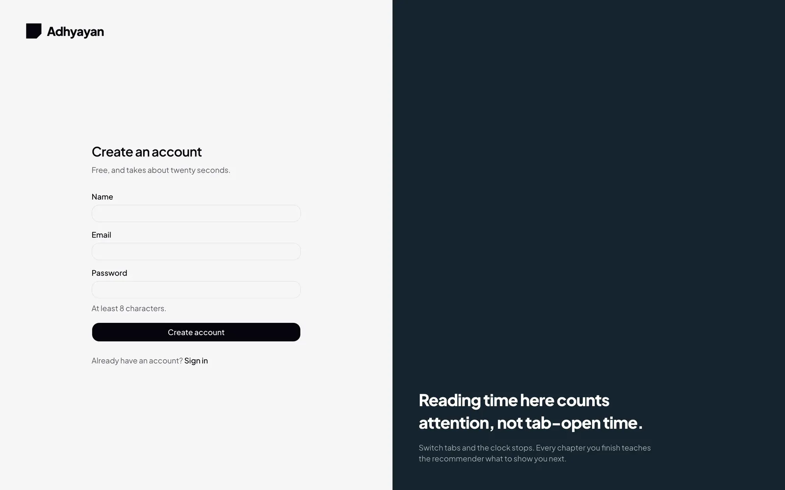 |

### Mobile

Every route is verified at 375px — no horizontal overflow, and the reader's
sidebar collapses into a sheet.

<p align="center">
  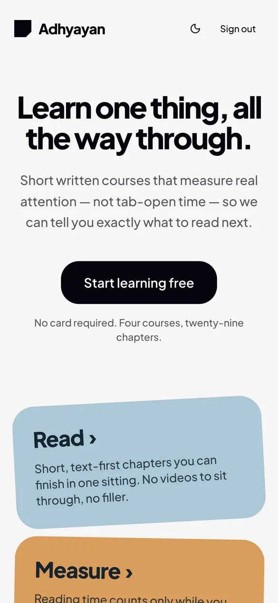
  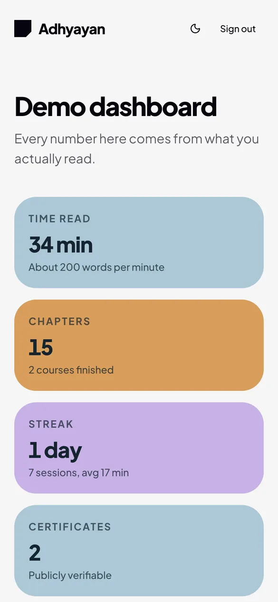
</p>

---

## How attention is measured

Naive tracking (`endTime - startTime`) reports 90 minutes of "reading" for someone
who opened a tab and went to lunch. Instead:

- A beat fires every 15s, and only when the page is **visible**, **focused**, and
  has seen input within the last 60s.
- Each beat credits the time that **actually elapsed**, not a flat interval —
  browsers throttle timers, and a flat interval silently loses the excess.
- The server clamps every beat to **20 seconds** and rejects beats less than 5s
  apart, so a client cannot inflate its own time.
- Exit uses `pagehide` + `navigator.sendBeacon`, not `beforeunload` + `fetch` —
  the latter is cancelled during navigation and loses the last segment of every
  chapter.

Measured end to end in a real browser:

| Scenario | Wall clock | Recorded |
| --- | --- | --- |
| Actively reading | 180s | **195s** |
| Window occluded | 180s | **75s** |
| Visible but idle | 200s | **44s** (gate closes after 3 beats) |
| Client claims 600s in one beat | — | **20s credited** |
| Five replayed beats of 20s | — | **20s credited, not 100s** |

---

## The ML engine

Python lives in [`ml/`](ml/README.md) and runs as a **batch job**. The request path
never calls it: the app reads the `Recommendation` table, so a dead model degrades
to the TypeScript heuristic with no user-visible error. That fallback is tested by
deleting the artifacts and reloading.

```bash
cd ml
uv sync
uv run python -m adhyayan_ml.train   # fit -> artifacts/
uv run python -m adhyayan_ml.score   # write Recommendation + MlProfile
```

Four models: TF-IDF course similarity, TruncatedSVD collaborative filtering, a
LogisticRegression/GradientBoosting ranker, and KMeans personas + RandomForest
dropout risk.

**Current honest result** (temporal holdout, 445 test rows):

| Arm | AUC | NDCG@3 |
| --- | --- | --- |
| Random | 0.469 | 0.366 |
| Heuristic (shipped) | 0.898 | 0.902 |
| Logistic regression | 0.734 | 0.841 |
| Gradient boosting | 0.876 | **0.936** |

The learned ranker beats the hand-tuned heuristic on NDCG@3 but **loses on AUC**.
Reported as measured rather than tuned until it looked better. See
[`ml/README.md`](ml/README.md) for the leakage audit behind these numbers — an
earlier run scored 0.99 AUC purely from three leaks.

---

## Seed data

Seeding restores a **committed snapshot of a known-good database**
(`prisma/fixtures/snapshot.json.gz`, 240 KB), so a fresh install is a complete,
populated platform rather than an empty shell:

| | |
| --- | --- |
| 62 learners across 8 behavioural personas | 6 courses, 45 chapters |
| 122 enrolments, 655 chapter-progress rows | 7,174 events |
| 68 certificates | **191 recommendations + 61 ML profiles** |

Because the ML output is included, the dashboard shows model-ranked
recommendations and `/admin/insights` shows real metrics **without running the
Python pipeline at all**.

Two details that matter:

- **Chapter markdown is not in the fixture.** `prisma/content/*.md` stays the
  single source of truth and is re-read on restore, so the two cannot drift.
- **Timestamps are re-based on restore.** Every date shifts forward by the
  fixture's age, so a months-old snapshot still yields live streaks and a
  populated events-per-day chart instead of looking abandoned.

To capture your own state as the new baseline: `npm run db:snapshot`, then commit
`prisma/fixtures/snapshot.json.gz`.

---

## Commands

| Command | Effect |
| --- | --- |
| `npm run dev` | Dev server on :3000 |
| `npm run build` | Production build — stop `next dev` first |
| `npx tsc --noEmit` | Typecheck |
| `npm run db:seed` | Restore the snapshot — skips if data exists |
| `npm run db:reseed` | `FORCE_SEED=1` — wipe and restore |
| `npm run db:seed:generate` | Ignore the fixture, generate fresh synthetic data |
| `npm run db:snapshot` | Export the current database to a new fixture |
| `npx prisma studio` | Inspect the database |
| `docker compose up` | Full stack |
| `docker compose run --rm ml` | Train and score |

---

## Project layout

```
src/
  app/            routes (App Router)
  components/     ui, learn/, dashboard/, insights/, marketing/
  hooks/          use-reading-tracker.ts   <- the attention measurement
  lib/            db, auth, events, progress, tracking, certificate, reco/
prisma/
  schema.prisma   10 models
  content/        45 chapters of markdown, read by the seed
  fixtures/       the committed database snapshot
  seed/           catalogue, personas, synthetic history, restore
ml/               the scikit-learn pipeline
docs/screenshots/ the images in this README
```

Stack landmines and project conventions are in [`CLAUDE.md`](CLAUDE.md); milestone
status and known issues are in [`TODO.md`](TODO.md).

---

## Known limitations

- **Click-through on `/admin/insights` sits on a handful of impressions**, so the
  A/B split is not yet statistically meaningful. It firms up with real usage.
- **The funnel looks flattering** (most registered learners complete a course)
  because it is dominated by seeded synthetic learners, who are deliberately more
  diligent than real ones.
- One upstream build warning from `jose` via `next-auth` (`CompressionStream`
  unsupported in Edge runtime). The code path is unreachable — Auth.js never sets
  the JWE `zip` header — and there is no clean fix without patching `node_modules`.
